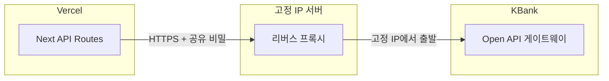

# KBank 연동 — 고정 IP(화이트리스트) 해결 가이드

은행 UAT/PROD 온보딩에서 **Partner IP Address**에 **고정 공인 IP**를 등록해야 하는 경우가 많습니다.  
**Vercel 서버리스만** 쓰면 **출구 IP가 고정되지 않아** 이 요구와 맞지 않을 수 있어, **고정 IP가 붙은 중간 서버(프록시/BFF)** 를 두는 방식이 일반적입니다.

---

## 1. 흐름 개요



- **은행이 보는 출발 IP** = 프록시가 돌아가는 VPS/클라우드의 **고정 공인 IP**  
- **Vercel**은 프록시 주소만 호출하고, **직접** `openapi*.kasikornbank.com`을 치지 않거나, 운영 정책에 맞게 선택합니다.

---

## 2. 고정 IP 만들기 (권장: 소형 VPS)

아래 중 **하나**만 골라도 됩니다. 공통으로 **Elastic IP / 고정 공인 IPv4**를 인스턴스에 연결합니다.

| 제공자 | 예시 | 비고 |
|--------|------|------|
| **AWS Lightsail** | $5/월 인스턴스 + 고정 IP 연결 | 설정 단순 |
| **DigitalOcean** | Droplet + Reserved IP | |
| **GCP** | VM + 외부 고정 IP 또는 Cloud NAT 고정 출구 | |
| **기타** | 사내 IDC/호스팅 고정 IP 서버 | |

### 2.1 한 가지로 고르기 (저렴 + 단순): **AWS Lightsail · 싱가포르**

요금·플랜은 변동하므로 [Lightsail 요금](https://aws.amazon.com/lightsail/pricing/)에서 최종 확인하세요. **“최소 Linux 번들 + 고정 IP”** 조합을 많이 씁니다.

| 항목 | 권장 |
|------|------|
| **리전** | **Singapore (ap-southeast-1)** — 태국 인근으로 지연·회선이 무난 편 |
| **인스턴스** | 가장 저렴한 **Linux/Unix** 플랜 1대 (512MB~1GB RAM면 Nginx 프록시만으로 충분한 경우가 많음) |
| **OS** | **Ubuntu 22.04 LTS** |
| **고정 IP** | Lightsail 콘솔 **Networking → Create static IP** → 해당 인스턴스에 **Attach** (인스턴스 삭제 전에 IP 분리하지 않으면 유지) |
| **온보딩 폼** | `공인IPv4:443` (예: `203.0.113.50:443`) |

**클릭 순서 요약:** 계정 → Lightsail → Create instance → 리전 싱가포르 → Ubuntu → 플랜 선택 → Create → Networking에서 Static IP 생성·연결 → 방화벽에 **HTTPS(443)** 허용.

이후 **§3 프록시 역할 · §4 Nginx 예시**대로 TLS + `X-Proxy-Secret` 을 올리면 됩니다.

**할 일 요약**

1. Ubuntu 22.04 등 **최소 사양 VM** 생성  
2. **고정 공인 IPv4** 할당(끊기지 않게 “Elastic / Reserved”로 고정)  
3. 방화벽: **443 인바운드** (Let’s Encrypt 또는 자체 TLS), **22는 본인 IP만** 등  
4. KBank 온보딩 폼 **Partner IP**에 예: `203.0.113.50:443` 형식으로 등록 (은행 예시 형식 준수)

---

## 3. 프록시 역할

- Vercel → **당신의 프록시** `https://kbank-proxy.귀사도메인.com` (또는 IP 직접은 인증서 이슈로 비권장)  
- 프록시 → `https://openapi-sandbox.kasikornbank.com` (UAT) / 운영 호스트 (PROD) 로 **경로 유지 전달**

**보안 (필수에 가깝게 권장)**

- 프록시는 **인터넷에 열려 있으므로**, Vercel에서만 아는 **`X-Proxy-Secret` 같은 공유 비밀** 헤더를 검증하고, 없으면 **403**  
- 또는 **IP 제한**은 Vercel 출구가 고정이 아니어서 어렵고, **비밀 헤더 + HTTPS** 조합이 현실적입니다.

---

## 4. Nginx 설정 예시 (개념)

> 실제 도메인·인증서·비밀 값은 본인 환경으로 교체하세요.  
> 아래는 **UAT 샌드박스**로만 포워딩하는 예입니다.

```nginx
# /etc/nginx/sites-available/kbank-proxy.conf

map $http_x_proxy_secret $kbank_allowed {
  default 0;
  "여기에-긴-랜덤-문자열" 1;
}

server {
  listen 443 ssl http2;
  server_name kbank-proxy.예시도메인.com;

  ssl_certificate     /etc/letsencrypt/live/kbank-proxy.예시도메인.com/fullchain.pem;
  ssl_certificate_key /etc/letsencrypt/live/kbank-proxy.예시도메인.com/privkey.pem;

  location / {
    if ($kbank_allowed = 0) { return 403; }

    proxy_pass https://openapi-sandbox.kasikornbank.com;
    proxy_ssl_server_name on;
    proxy_set_header Host openapi-sandbox.kasikornbank.com;
    proxy_set_header X-Real-IP $remote_addr;
    proxy_set_header X-Forwarded-For $proxy_add_x_forwarded_for;
    proxy_set_header X-Forwarded-Proto $scheme;

    # 클라이언트가 보낸 Authorization 등은 그대로 전달
    proxy_pass_request_headers on;
  }
}
```

- PROD 전환 시 `proxy_pass` 대상 호스트를 **운영 Open API 베이스 URL**로 변경합니다.  
- Certbot 등으로 **TLS**를 꼭 적용합니다.

---

## 4.1 실행 순서 (도메인 → HTTPS → 프록시)

고정 IP 예: `3.1.70.209` — 본인 Static IP로 바꿉니다.  
프록시용 호스트 예: `kbank-proxy.회사도메인.com` — 본인이 쓸 **FQDN**으로 바꿉니다.

### (1) 도메인 DNS (A 레코드) — 상세

#### DNS가 하는 일 (한 줄)

인터넷은 **`kbank-proxy.example.com` 같은 이름**을 기억하지 않고 **`3.1.70.209` 같은 IP**만 찾아갑니다.  
**DNS**는 “이 이름 → 이 IP”를 전 세계에 알려 주는 **전화번호부** 역할입니다.  
우리가 할 일은 전화번호부에 **한 줄(A 레코드)** 을 추가하는 것입니다.

#### 왜 `vercel.app` 로는 안 되나

`choongman-erp.vercel.app` 은 **Vercel이 관리하는 도메인**이라, 우리가 **임의로 `A` 레코드를 추가해서 Lightsail IP를 가리키게** 할 수 없습니다.  
그래서 **본인이 DNS를 편집할 수 있는 도메인**이 필요합니다.

#### 도메인은 어디서 구하나

아래 **하나**만 있으면 됩니다.

| 경우 | 할 일 |
|------|--------|
| 회사 도메인이 이미 있음 (`example.co.kr` 등) | **그 도메인을 판 곳** 또는 **DNS만 맡긴 곳**에 로그인 |
| 아무 도메인도 없음 | 가비아, Namecheap, Cloudflare Registrar, Route53 등에서 **1년 단위로 도메인 구매** (연 1만 원대부터 흔함) |

구입 후 **“DNS 관리 / 네임서버 / 레코드 관리”** 메뉴를 찾습니다. (업체마다 이름이 조금 다름)

#### A 레코드에 넣을 값 (개념)

- **전체 주소(FQDN)** 를 예를 들어 `kbank-proxy.choongman.co.kr` 로 쓴다고 하면  
  - **이름(Name / Host / 호스트)** 칸: 보통 **`kbank-proxy` 만**  
    - 일부 업체는 **비우면 루트 도메인**이 되고, `kbank-proxy` 를 쓰면 **서브도메인**이 됩니다.  
    - 어떤 곳은 **풀 도메인**을 요구하기도 합니다. 화면 도움말을 따르세요.  
  - **유형(Type / 타입)**: **`A`** (또는 **A 레코드**)  
  - **값(Value / Points to / 데이터)**: Lightsail Static IP **`3.1.70.209`** (따옴표 없이 숫자만)  
  - **TTL**: **기본값 / Auto** 로 두면 됨  

저장 후 **최종적으로 브라우저에 치는 주소**는:

`https://kbank-proxy.choongman.co.kr`  
(앞의 `kbank-proxy` + `.` + **구입한 도메인**)

#### Cloudflare를 쓰는 경우 (흔한 실수)

- DNS만 Cloudflare에 두었다면 **같은 방식으로 A 레코드** 추가.  
- **프록시(주황 구름 “Proxied”)** 를 켜 두면, 밖에서 보는 IP가 **Cloudflare IP**로 바뀌어 Let’s Encrypt·테스트가 헷갈릴 수 있습니다.  
  - **처음 설정·인증서 발급** 때는 **DNS only (회색 구름)** 으로 두는 것을 권장합니다.  
  - 익숙해지면 다시 정책을 조정해도 됩니다.

#### 전파 확인 (내 PC에서)

몇 분~최대 수십 분 걸릴 수 있습니다.

**Windows PowerShell 또는 CMD:**

```text
nslookup kbank-proxy.choongman.co.kr
```

**응답의 Address** 가 **`3.1.70.209`** 이면 OK.

또는:

```text
ping kbank-proxy.choongman.co.kr
```

첫 줄에 나오는 IP가 **3.1.70.209** 인지 확인 (ping이 막혀도 **이름이 IP로 풀리는지**만 보면 됨).

#### 자주 막히는 경우

| 증상 | 점검 |
|------|------|
| nslookup 이 **다른 IP** | A 레코드 값 오타, 또는 Cloudflare 프록시 켜짐, 또는 예전 레코드 캐시 — TTL 기다리기 |
| **이름을 잘못 넣음** | `kbank-proxy.choongman.co.kr` 전체를 Name 칸에 넣어 이중으로 붙는 경우 있음 — 업체 안내에 맞게 **짧은 호스트만** |
| **도메인을 샀는데 DNS 수정 화면이 없음** | 도메인만 사고 **네임서버가 기본 레지스트라**인지 **Cloudflare**인지 확인 후, **실제 권한이 있는 패널**에서 레코드 추가 |
| **www** 만 있고 서브도메인 추가 방법을 모름 | “Add record” → Type **A**, Host **kbank-proxy** |

#### Certbot에 넣을 이름

`certbot --nginx -d ???` 에 넣는 것은 **DNS에서 만든 전체 이름 하나**와 **완전히 동일**해야 합니다.

예: `kbank-proxy.choongman.co.kr`

### (2) Lightsail 방화벽

인스턴스 → **Networking** → Firewall rules에 다음이 있어야 합니다.

| 애플리케이션 | 포트 | 출처 |
|--------------|------|------|
| SSH | 22 | My IP (또는 제한) |
| HTTP | 80 | Anywhere (Let’s Encrypt 인증용) |
| HTTPS | 443 | Anywhere |

### (3) SSH 접속 후 패키지 설치

```bash
sudo apt update
sudo apt install -y nginx certbot python3-certbot-nginx
```

### (4) 비밀 문자열 정하기

Vercel과 서버만 아는 **긴 랜덤 값** 하나 생성 (예: 32자 이상).  
아래 설정의 `여기에-긴-랜덤-문자열` / `KBANK_PROXY_SECRET` 자리에 **동일한 값**을 넣습니다.

```bash
openssl rand -hex 32
```

### (5) 인증서 발급 (Certbot + Nginx)

먼저 **80 포트**로 도메인이 이 서버로 오는지 확인된 뒤:

```bash
sudo certbot --nginx -d kbank-proxy.회사도메인.com
```

이메일·약관 동의 후 성공하면 `/etc/letsencrypt/live/kbank-proxy.회사도메인.com/` 에 인증서가 생깁니다.

### (6) Nginx에 프록시 + `X-Proxy-Secret` 반영

Certbot이 수정한 파일(보통 `/etc/nginx/sites-available/default` 또는 별도 site)을 열어, **`listen 443 ssl` 블록의 `location /`** 를 아래처럼 맞추거나, 사이트 전체를 교체합니다.

**파일 상단( `server` 밖)** 에 `map` 추가:

```nginx
map $http_x_proxy_secret $kbank_allowed {
  default 0;
  "openssl로-만든-값과-동일" 1;
}
```

**`server { ... }` 안 `location /`** (UAT 샌드박스 기준):

```nginx
location / {
  if ($kbank_allowed = 0) { return 403; }

  proxy_pass https://openapi-sandbox.kasikornbank.com;
  proxy_ssl_server_name on;
  proxy_set_header Host openapi-sandbox.kasikornbank.com;
  proxy_set_header X-Real-IP $remote_addr;
  proxy_set_header X-Forwarded-For $proxy_add_x_forwarded_for;
  proxy_set_header X-Forwarded-Proto $scheme;
  proxy_pass_request_headers on;
}
```

`server_name`, `ssl_certificate` 경로는 **Certbot이 넣은 값**을 유지합니다.

검사 후 재시작:

```bash
sudo nginx -t && sudo systemctl reload nginx
```

### (7) 동작 확인

본인 PC에서 (시크릿은 예시):

```bash
curl -s -o /dev/null -w "%{http_code}" -H "X-Proxy-Secret: openssl로-만든-값과-동일" "https://kbank-proxy.회사도메인.com/v2/oauth/token"
```

- `403` → 시크릿 불일치 또는 `map` 오타  
- `405` 등 → 은행 쪽이 **GET 거부**(정상에 가까움 — POST만 받음)  
- 연결 자체가 안 되면 DNS·방화벽·443 확인  

### 도메인이 전혀 없을 때

- Let’s Encrypt **DNS-01** 인증(Cloudflare API 등)은 고급 설정이라 초기에는 **저렴한 도메인 1개**를 사서 A 레코드만 거는 편이 빠릅니다.  
- **공인 IP만**으로 무료 신뢰 인증서를 쓰는 일반적인 방법은 없습니다.

---

## 5. Vercel(앱) 쪽에서 할 일

1. **환경 변수** (이름은 팀 규칙에 맞게)  
   - `KBANK_OPENAPI_BASE_URL=https://kbank-proxy.예시도메인.com`  
   - `KBANK_PROXY_SECRET=위에서-쓴-동일-비밀`

2. **KBank 호출 코드**에서  
   - 기본 호스트 대신 `KBANK_OPENAPI_BASE_URL` 사용  
   - 모든 서버 간 요청에 `X-Proxy-Secret: KBANK_PROXY_SECRET` 추가  

3. **웹훅 수신 URL**은 기존처럼 `https://choongman-erp.vercel.app/api/...` 로 두어도 됩니다(들어오는 트래픽).  
   **Partner IP**와 직접 대응하는 것은 주로 **우리 → 은행 API 호출 출구**입니다.

---

## 6. 확인 체크리스트

- [ ] VPS에서 `curl -s https://ifconfig.me` 가 **여러 날 동일**한지 확인  
- [ ] 폼에 적은 `IP:포트`가 **실제 443 리스닝**과 일치하는지  
- [ ] 프록시 없이 Vercel에서 은행을 직접 치면 **화이트리스트에 걸리는지** — 운영에서는 **프록시 경로만** 쓰기로 통일  
- [ ] `KBANK_PROXY_SECRET` 을 **Vercel·서버에만** 두고 Git에 올리지 않기  

---

## 7. 은행과 맞출 질문 (영문은 이전에 드린 메일 초안 참고)

- UAT에 **프록시 1대의 고정 IP만** 등록하면 되는지  
- 등록 후 **IP 변경 절차**  
- **샌드박스 vs 운영** 호스트가 다를 때 프록시를 **두 베이스**로 나눌지, 경로로 나눌지  

---

## 8. 다음 단계

고정 IP 서버가 생기면:

1. 온보딩 폼 **Partner IP** 제출  
2. 프록시 배포 + 비밀 헤더 검증  
3. `vercel-app` 내 KBank 클라이언트가 생기면 **베이스 URL·시크릿**을 위 환경 변수로 연결  

이 문서는 **인프라·보안 원칙**만 담습니다. 실제 API 클라이언트 구현은 KBank 스펙에 맞춰 별도로 추가합니다.

---

## 9. Vercel 웹훅·스위치백 스텁 (온보딩 URL 대응)

다음이 추가되어 있으며, 배포 후 **200 JSON(웹훅)** / **안내 페이지(스위치백)** 로 응답합니다.

| 제출 URL 패턴 | 구현 |
|---------------|------|
| `https://choongman-erp.vercel.app/api/webhooks/kbank/...` | `app/api/webhooks/kbank/[...path]/route.ts` (GET·POST·OPTIONS) |
| `https://choongman-erp.vercel.app/payment/return` | `app/payment/return/page.tsx` |
| `https://choongman-erp.vercel.app/pos/payment/return` | `app/pos/payment/return/page.tsx` |

실제 **서명 검증·주문 반영**은 이후 같은 파일·경로에서 확장하면 됩니다.

배포 후 확인 절차는 **[KBANK-PRE-BANK-CHECKLIST.md](./KBANK-PRE-BANK-CHECKLIST.md)** 를 따르면 됩니다.
