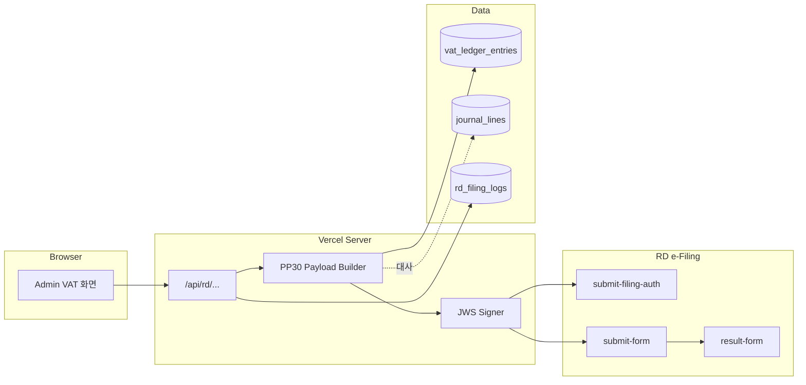

# RD e-Filing Open API 연동 설계 (PP30 · 1차안)

태국 국세청(กรมสรรพากร) **e-Filing Open API**와 **ภ.พ.30 (PP30)** 제출을 CM_ERP에 붙이기 위한 **서버 전용 아키텍처**와 **데이터 매핑 1차안**입니다.

- 공식 스펙: [ข้อมูล API Spec](https://efiling.rd.go.th/rd-cms/api)  
- 연결 신청: [การขอเชื่อมต่อ Open API](https://efiling.rd.go.th/rd-cms/openapi)  
- PP30 데이터 포맷 상세: 스펙 페이지 내 **Data_Format_PP30_*.pdf** 링크(버전은 RD 배포본 기준으로 갱신)

---

## 1. 원칙: 클라이언트는 RD와 직접 통신하지 않음

| 항목 | 내용 |
|------|------|
| **호출 주체** | Vercel **서버 전용** Route Handler만 RD `https://...` 엔드포인트 호출 |
| **비밀 정보** | RD 사용자명/비밀번호, 클라이언트 시크릿, **서명용 키·인증서**는 환경 변수 또는 RD 승인 후 안내하는 저장소(예: Vercel Secrets, 별도 KMS)에만 보관 |
| **브라우저** | RD 토큰·원문 페이로드·개인키를 절대 노출하지 않음. UI는 “기간 선택 → 초안 검토 → 서버에 제출 요청”만 |
| **감사** | `requestId`, RD `refNo`, 응답 코드, 제출 시각(방콕), 연도·월, 납세자 ID를 DB에 append-only 로그 권장 |

---

## 2. API 흐름 (스펙 요약)

스펙 표준 흐름(실제 URL·헤더는 RD 최신 문서 준수):

1. **POST** `.../oapi/submit-filing-auth`  
   - Body: `eFiling.username`, `password`, `nonce` 등  
   - Response: `tokenId` (Bearer)
2. **POST** `.../oapi/submit-form`  
   - Header: `Authorization: Bearer <tokenId>`, `Content-Type: application/json`  
   - Body: `eFiling.sender`, `requestId`, `rdForm.exchangeDocument` (`formType: "PP30"`, `version`), `rdForm.formData` 배열  
   - 스펙 후반: 페이로드 **JWS** 요구 가능 → 구현 시 RD 제공 **서명 절차·샘플**을 그대로 따름
3. 선택: `payin-form`, `receipt-form`, `cancel-form`, `result-form`

**주의:** 엔드포인트 베이스 URL, 샌드박스, IP 허용 등은 **Open API 승인 후** 받는 자료가 정본입니다.

---

## 3. PP30 `formData` 예시 구조와 우리 DB 매핑 (1차)

RD 스펙 예시(JSON) 기준으로, CM_ERP 쪽 소스는 두 갈래로 본다.

- **1순위:** `vat_ledger_entries` — 신고 단위(매출/매입) 명세와 합계에 가장 가깝다.  
- **2순위(대사):** `journal_lines` — 계정 `2180`(부가세예수금), `4110`(매출) 등으로 **회계상 VAT와 신고 초안이 맞는지** 검증.

### 3.1 `taxPayer` · `taxForm`

| RD 필드 (예시 경로) | 의미 | CM_ERP 매핑 (1차) |
|---------------------|------|-------------------|
| `taxPayer.specifiedTaxRegistration.id` | 납세자 TIN | 설정 또는 `accounting_filing_preferences` 등 **별도 마스터** (신규 필드 권장) |
| `taxPayer.branchNo`, `branchType` | 지점 | 마스터 또는 고정값; 다지점이면 RD 규칙에 맞게 확장 |
| `taxForm.taxPeriod.taxMonth`, `taxYear` | 과세 기간 | UI 선택 `YYYY-MM` → `taxMonth` 1–12, `taxYear` **พ.ศ.(BE)** 변환 |
| `taxForm.filing.filingType`, `filingNo`, `filingCase` | 신고 유형/차수 | RD PDF·매뉴얼 코드표 준수; 초기값은 스펙 예시와 동일하게 두고 운영에서 확정 |
| `taxForm.consolidatitonFilingStatus` | 합산 신고 여부 | 사업 구조에 맞게 마스터화 |

### 3.2 `taxFormDetail.detail` — 핵심 금액 (스펙 예시 필드명)

RD 예시에 나오는 블록:

- `saleTax`: `amt`, `vatAmt`, `monTax`, `extra.amtS` / `amtB`, `expAmt`, `exeAmt`  
- `purchaseTax`: `amt`, `extra`, `monTax`  
- `calculate`: `diffTaxAmtU`, `oldFwdTax`, `diffTotTaxAmtU`, `refundType`, `vatRate` 등

**우리 `vat_ledger_entries` 집계 (동일 `tax_month`, 필요 시 `store_name` 필터):**

| RD 목적 (개념) | `vat_ledger_entries` 소스 | 집계 규칙 (1차안) |
|----------------|----------------------------|-------------------|
| 매출 과세표준·세액 | `direction = 'output'` | `SUM(net_amount)` → `saleTax` 계열 **과세 매출액** 후보; `SUM(vat_amount)` → `vatAmt` / `monTax` 후보 (RD가 필드별 정의를 나누면 PDF 기준으로 쪼갬) |
| 매입 세액 | `direction = 'input'` | `SUM(net_amount)`, `SUM(vat_amount)` → `purchaseTax` 후보 |
| 면세·수출·특례 | RD 전용 컬럼 (`exeAmt`, `expAmt` 등) | 현재 테이블에는 없음 → **`vat_status` 코드화** 또는 **RD 코드별 부속 컬럼/자식 테이블** 추가가 2차 과제 |

**한계 (명시):**

- PP30 양식은 **라인이 세분**되어 있음(면세 매출, 0%, 수출, 이자 등). 지금 스키마는 `direction` + `net_amount` + `vat_amount` + `vat_status`(자유 텍스트) 수준이라, **스펙 PDF의 각 칸과 1:1이 되려면** `vat_status`를 RD 코드 ENUM으로 정리하거나 **행 단위로 form line type**을 두는 설계가 필요합니다.

### 3.3 `journal_lines` — 대사용 (제출 직전)

| 검증 | 방법 |
|------|------|
| 매출 VAT vs 장부 | `account_code` `4110` 등 매출·`2180` 예수금 라인과 **월별 합계** 비교 (프로젝트 내 `getAccountingReconcile` 패턴 참고) |
| 불일치 시 | 제출 차단 또는 “경고 후 수동 확인” 플래그; 로그에 diff 저장 |

---

## 4. 구현 단계 제안

| 단계 | 내용 |
|------|------|
| **P0** | RD Open API **테스트 계정·엔드포인트·JWS** 확정; `rd_filing_logs` 테이블(또는 기존 워크플로 확장) 설계 |
| **P1** | `POST /api/rd/pp30-draft` — `tax_month` 입력 → DB 집계 → **PP30 JSON 초안** 반환(서명 없음, 내부용) |
| **P2** | `POST /api/rd/pp30-submit` — JWS 서명 + `submit-filing-auth` + `submit-form`; 응답·`refNo` 저장 |
| **P3** | `vat_status` / RD 라인 타입 정규화 → PDF 양식과 **필드 단위 매핑** 완성 |

---

## 5. 환경 변수 (예시 이름)

실제 키 이름은 RD 안내에 맞출 것.

- `RD_EFILING_BASE_URL`  
- `RD_EFILING_USERNAME` / `RD_EFILING_PASSWORD` (또는 OAuth 클라이언트 방식이면 대체)  
- `RD_SENDER_ID` (스펙의 `sender.id`)  
- `RD_SIGNING_*` — 인증서·키 경로 또는 HSM 연동 설정

---

## 6. 관련 코드 위치 (CM_ERP)

- VAT 부속장부 API: [app/api/vatLedger/route.ts](../app/api/vatLedger/route.ts)  
- VAT 월 집계(요약): [app/api/getThaiTaxFilingSummary/route.ts](../app/api/getThaiTaxFilingSummary/route.ts)  
- 스키마: [sql/000_accounting_core_one_shot.sql](../sql/000_accounting_core_one_shot.sql) (`vat_ledger_entries`)

---

## 7. 변경 이력

| 날짜 | 내용 |
|------|------|
| 2026-04-02 | 초안: 서버 아키텍처 + PP30↔vat_ledger 1차 매핑 |

이 문서는 **RD 공식 PDF/승인 자료가 갱신되면** `formType`/`version`/필드명을 반드시 재대조하세요.
